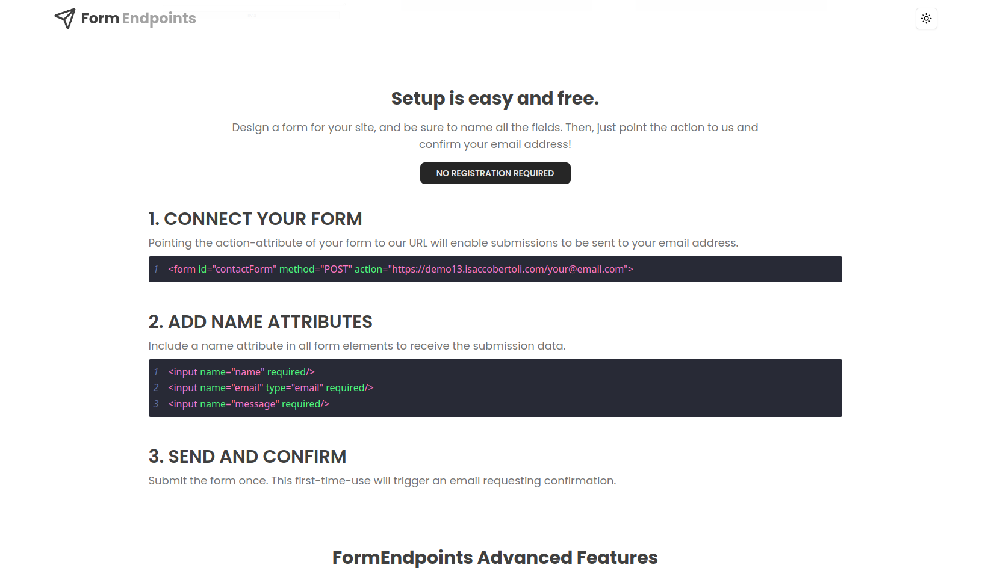
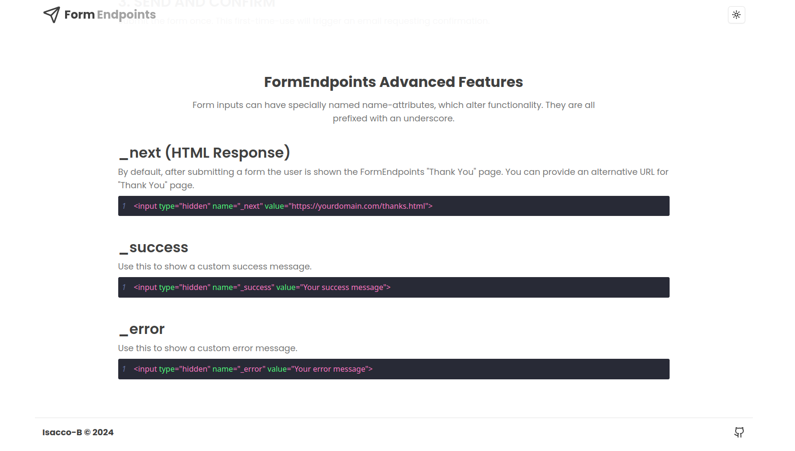

# Form Endpoints

- **Form Endpoints** provides simple and hassle-free endpoints for your HTML forms. Just connect your form to our endpoint, and we'll handle the rest by emailing you the submissions. No need for PHP, JavaScript, or any backend code.
- Demo: https://demo14.isaccobertoli.com/


## Tech Stack Client

- React
- Tailwind
- Typescript
- Shadcn UI


## Tech Stack Server

- Node
- Express
- Sequelize
- SQLite
- Crypto


## Client Images

<div>
    
    
    
</div>


## Getting Up and Running Locally

### Clone Repo

```bash
git clone https://github.com/Isacco-B/form-endpoints
```
### Client

```bash
cd client
```
- Install dependencies

```bash
npm install
```

- Start server

```bash
npm run dev
```

### Server

```bash
cd server
```

- Create .env file with the following variables:

```bash
NODE_ENV=development|production
PORT=3000
HOST=server url

EMAIL_HOST=""
EMAIL_NAME=""
EMAIL_ADDRESS=""
EMAIL_PASSWORD=""
EMAIL_PORT=""
EMAIL_SECURITY=""
```

- Install dependencies

```bash
npm install
```

- Start server

```bash
npm run dev
```

## 🔗 Links

[](https://www.linkedin.com/in/isacco-bertoli-10aa16252/)
